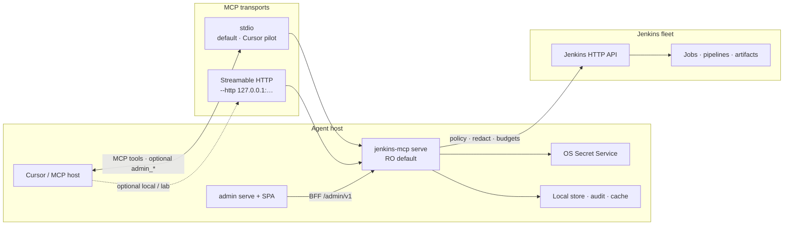

<p align="center">
  
</p>

<p align="center">
  <strong>Enterprise Jenkins MCP for Cursor and other AI agents</strong><br/>
  Local-first · keyring secrets · read-only by default · redacted diagnostics
</p>

<p align="center">
  <a href="https://hilather.github.io/go-jenkins-mcp/"></a>
  <a href="https://github.com/hilather/go-jenkins-mcp/releases/latest"></a>
  <a href="https://github.com/hilather/go-jenkins-mcp/actions/workflows/ci.yml"></a>
  <a href="LICENSE"></a>
  <a href="go.mod"></a>
</p>

<p align="center">
  <a href="https://hilather.github.io/go-jenkins-mcp/">Website</a> ·
  <a href="https://hilather.github.io/go-jenkins-mcp/getting-started.html">Quick start</a> ·
  <a href="docs/user/README.md">User guide</a> ·
  <a href="docs/security/operator-guide.md">Security</a> ·
  <a href="docs/jenkins-mcp-enterprise-architecture.md">Architecture</a> ·
  <a href="https://github.com/hilather/go-jenkins-mcp/releases">Releases</a>
</p>

---

## Status

| | |
| --- | --- |
| **Release** | [**v0.5.0**](https://github.com/hilather/go-jenkins-mcp/releases/tag/v0.5.0) · [notes](https://github.com/hilather/go-jenkins-mcp/blob/v0.5.0/docs/release/RELEASE_NOTES_v0.5.0.md) |
| **Go** | **1.25.x** (see `go.mod`) · MCP Go SDK **v1.7.0** (ADR 0006) |
| **Posture** | Pilot-ready **RO stdio** · mutations / admin MCP / fleet MCP **opt-in** · residual honesty required |
| **Free-lab / offline** | Gateway modes A/B/C + SAML lab Done\* — [free-lab-qualification](https://github.com/hilather/go-jenkins-mcp/blob/master/docs/gateway/free-lab-qualification.md) |
| **Site residual** | Entra / production jwt-auth-filter / AgentCore pin = **operator-owned** — [live-pin-blockers](https://github.com/hilather/go-jenkins-mcp/blob/master/docs/gateway/live-pin-blockers.md) |

**Still open / SoT:** [agent backlog](https://github.com/hilather/go-jenkins-mcp/blob/master/docs/jenkins-mcp-enterprise-agent-todo.md) · [product residuals](https://github.com/hilather/go-jenkins-mcp/blob/master/docs/security/product-residuals.md) · multi-fleet [rollout](https://github.com/hilather/go-jenkins-mcp/blob/master/docs/fleet/multi-fleet-rollout.md) · admin [MCP-OPS](https://github.com/hilather/go-jenkins-mcp/blob/master/docs/admin/mcp-ops-parity.md)

Historical phase/wave boards (Done\* archaeology, not the product status surface): [phase0](https://github.com/hilather/go-jenkins-mcp/blob/master/docs/phase0-progress.md) · [phase1](https://github.com/hilather/go-jenkins-mcp/blob/master/docs/phase1-progress.md) · [phase2](https://github.com/hilather/go-jenkins-mcp/blob/master/docs/phase2-progress.md) · [docs index](https://github.com/hilather/go-jenkins-mcp/blob/master/docs/README.md).

---

## Why this exists

AI agents are excellent at reading build logs — and terrible at handling secrets,
blast radius, and audit trails. **go-jenkins-mcp** is a Go [Model Context Protocol](https://modelcontextprotocol.io/)
server that puts Cursor (and compatible hosts) on a short leash against Jenkins:

| Problem | How this project handles it |
| --- | --- |
| Tokens end up in `mcp.json` / shell history | Personal credentials live in the **OS keyring** after `login` |
| Agents over-write production | **Read-only by default**; mutations are opt-in with preview/confirm |
| Logs leak secrets into agent context | Built-in **redaction** on tool output and support bundles |
| Policy drifts per laptop | **Signed policy overlays** + fail-closed budgets + per-user/group denials |
| No operator day-2 surface | **Admin console** + opt-in **`admin_*` MCP** tools for agents |
| Diagnose-by-vibes | Deep **diagnostic tool surface** (compare, regression window, evidence) |

Product module: `github.com/hilather/go-jenkins-mcp`. Origin history (past-tense import only): [docs/HISTORY.md](docs/HISTORY.md).

---

## Features

### Data plane (Jenkins MCP)

- **Local-first stdio MCP** — Cursor-native process entry (ADR 0002); optional loopback/gateway HTTP
- **Profiles without secrets** — URL / TLS / proxy only; tokens never in config files
- **`login` → Secret Service** — verified whoAmI bind; mid-serve re-verify fail-closed
- **RO default** — enterprise `force_read_only` cannot be defeated by casual flags
- **Deny-only RBAC** — tools, jobs, nodes, views, artifacts, branches + budgets (POL-001…005)
- **Per-user / per-group bindings (POL-006)** — overlay `subjects.users[]` / `subjects.groups[]`; list-row privacy + result caps
- **Mutation safety** — opt-in `--allow-mutations`; preview → confirm TTL; allowlists
- **Bounded logs & search** — progressive Zstd frames; no unbounded `ReadAll`
- **Local cache** — per-profile L1 frames + L2 packs under XDG (default **10 GiB** quota, pins, maintenance); gateway process caches optional same-host file share — [docs/caching.md](docs/caching.md)
- **Redaction & audit (AUD-001)** — JSONL audit; operator **type enable/disable**; catalog in `KnownEventTypes`
- **Diagnostics** — doctor, compare, regression window, support-bundle (secret-free)

### Operator plane (admin)

- **Admin console** — `jenkins-mcp admin serve` + React SPA (`web/admin/`); roles `viewer` / `operator` / `policy_admin`
- **Shared-secret auth (v1)** — one process-wide role; **no local admin user directory** ([design notes](docs/admin/README.md))
- **SAML SP SSO (POL-007 Done\* offline)** — config-managed SP (`JENKINS_MCP_SAML_CONFIG`), group→role map, ACS session; live IdP pin residual (ADR 0015)
- **Apache ECharts only** for metrics charts; Metrics always visualized
- **Opt-in admin MCP (MCP-OPS)** — `--enable-admin-mcp` registers `admin_*` tools (shared libs with BFF, not HTTP proxy)

### Gateway / multi-user (Tier A offline Done\*)

| Mode | Credential | Status |
| --- | --- | --- |
| **A** | API-token vault (`gateway vault`) | Offline + disposable Jenkins lab Done\* |
| **B** | Jenkins-audience JWT RS bearer (`gateway jwt-vault`) | Offline + free mock RS lab Done\*; **site** jwt-auth-filter pin operator residual |
| **C** | AgentCore / 3LO-OBO Obtain | Offline + free mock-token lab Done\*; **site** Entra pin operator residual |

**Product free-lab bar** (kept): [free-lab-qualification](docs/gateway/free-lab-qualification.md).  
**Site production pin** (optional operator runbook): [live-pin-blockers](docs/gateway/live-pin-blockers.md).

### Packaging & platform

- **Tier-1 only:** Rocky Linux + Ubuntu · **macOS and Windows out of scope**
- Tarball + DEB (`make package`); RPM when `rpmbuild` present
- Local Docker admin stack: `deploy/local/` + `make local-docker-*` (Cursor stdio stays host-native)

---

## Quick start

### 1. Build

Requires **Go 1.25+** (see `go.mod`). Unit tests never need live Jenkins credentials.

```bash
export PATH="$HOME/.local/go/bin:$PATH"   # if needed
make test
make build
./bin/jenkins-mcp version --json
```

Optional packages / SPA:

```bash
make admin-ui          # builds web/admin → web/admin/dist
make package           # tarball (+ .deb when dpkg-deb available)
make residual-smoke    # offline residual honesty (not live GO)
```

### 2. Profile + login (no secrets in git or shell history)

```bash
./bin/jenkins-mcp profile add corp --url https://jenkins.example.corp/
./bin/jenkins-mcp login --profile corp          # prompts; stores token in Secret Service
./bin/jenkins-mcp status --profile corp
./bin/jenkins-mcp doctor --profile corp --offline
```

### 3. Cursor MCP entry (read-only pilot)

```json
{
  "mcpServers": {
    "jenkins": {
      "command": "jenkins-mcp",
      "args": ["serve", "--profile", "corp", "--read-only", "--stdio"],
      "env": {
        "JENKINS_MCP_READ_ONLY": "true"
      }
    }
  }
}
```

> **Never** put API tokens, `user:token`, or `JENKINS_MCP_AUTH` in `args` / `env`.  
> That bootstrap path is **removed** (fail closed); use `login --profile` + keyring only.

### 4. Optional day-2 surfaces

```bash
# Operator admin console (loopback; set token for non-pilot)
jenkins-mcp admin serve --admin-role operator --admin-token-env JENKINS_MCP_ADMIN_TOKEN

# Agents managing ops without admin HTTP (default off)
jenkins-mcp serve --profile corp --enable-admin-mcp --admin-role operator

# Opt-in mutations (default off; blocked by --read-only / force_read_only / env RO)
jenkins-mcp serve --profile corp --stdio --allow-mutations
```

Mutations stay **disabled** unless `--allow-mutations` is set and no stronger RO is effective. User guide: [`docs/user/README.md` § Mutations](docs/user/README.md#7-mutations-disabled-by-default).

Full pilot path: [`docs/user/README.md`](docs/user/README.md) · agent ops: [`docs/agent-usage.md`](docs/agent-usage.md) · product walkthrough: [getting started](https://hilather.github.io/go-jenkins-mcp/getting-started.html)

---

## Architecture at a glance



### MCP transports (local)

| Mode | How | When |
| --- | --- | --- |
| **stdio** (default) | `serve --stdio` / default Cursor entry | **Pilot and production local** path (ADR 0002). No listening port. |
| **Streamable HTTP** | `serve --http 127.0.0.1:8765` | Local debugging, Docker support stack, or gateway-style peers. **Loopback by default.** |

HTTP notes (fail closed; details in [`docs/packaging.md`](docs/packaging.md)):

- Prefer **loopback** bind; non-local needs `--http-allow-non-local` + allowed Host/Origin + **shared secret**
- Optional token: `--http-token-env` / `--http-token-file` (`Authorization: Bearer` or `X-Jenkins-MCP-Token`)
- Optional force token: `--http-require-token` / `JENKINS_MCP_HTTP_REQUIRE_TOKEN`
- **Not** multi-tenant OAuth and **not** a replacement for stdio Cursor pilot

```bash
# Local MCP over HTTP (loopback) — same profile + RO posture as stdio
jenkins-mcp serve --profile corp --http 127.0.0.1:8765 --read-only
# Stronger loopback gate (recommended for anything beyond a throwaway lab):
# jenkins-mcp serve --profile corp --http 127.0.0.1:8765 --http-require-token \
#   --http-token-env=MCP_HTTP_TOKEN --read-only
```

Admin console (`admin serve` on `:8787`) is a **separate** operator BFF/SPA surface — not the MCP Streamable HTTP port.

| Layer | Responsibility |
| --- | --- |
| `cmd/jenkins-mcp` | Process entry (**stdio default**, optional **`--http`**, gateway, admin) |
| `internal/mcpserver` | Streamable HTTP serve (loopback / origin / token gates) |
| `internal/tools` | MCP tool registration — no raw Jenkins HTTP |
| `internal/jenkins` | Jenkins HTTP client — no MCP imports |
| `internal/admin` + `web/admin` | Operator BFF + SPA (ADR 0014) — distinct from MCP HTTP |
| `internal/adminops` | Shared day-2 ops for BFF **and** `admin_*` MCP tools |
| `internal/{auth,policy,audit,mutation,store,gateway,…}` | Enterprise controls |
| `internal/adapter` | Optional integrations — **off by default** |
| `deploy/local`, `testdata/*` | Docker labs (opt-in; not default `make test`) |
| `site/` | Public product site (GitHub Pages) |

Deep dive: [`docs/jenkins-mcp-enterprise-architecture.md`](docs/jenkins-mcp-enterprise-architecture.md) · ADR 0002 · [packaging HTTP](docs/packaging.md)
---

## Security posture

- **Fail closed:** Jenkins allow ∧ global read-only ∧ MCP policy ∧ budgets
- **Secrets:** keyring / vault / env — never in profiles, MCP config, fixtures, or CI logs
- **Redaction:** tool results and support bundles scrub sensitive material
- **Audit:** security-relevant paths emit AUD-001; operators toggle types via admin Audit settings
- **Mutations:** disabled unless explicitly enabled; confirmation token TTL enforced
- **Admin users (v1):** shared secret + process role — not a multi-operator account DB
- **Platforms:** Tier-1 Rocky Linux + Ubuntu only · **macOS and Windows out of scope**

Operator guide: [`docs/security/operator-guide.md`](docs/security/operator-guide.md)  
Threat model: [`docs/security/threat-model.md`](docs/security/threat-model.md)  
Reporting: [`SECURITY.md`](SECURITY.md)

---

## Documentation map

| Start here | |
| --- | --- |
| [Product site](https://hilather.github.io/go-jenkins-mcp/) | Polished overview, start, architecture, security, docs hub |
| [User guide](docs/user/README.md) | Install → login → Cursor → diagnose workflows |
| [Admin guide](docs/admin/README.md) | Console, policy, gateway residual, admin-user design |
| [Admin API v1](docs/admin/api-v1.md) | BFF HTTP contract |
| [MCP-OPS parity](docs/admin/mcp-ops-parity.md) | `admin_*` tool matrix |
| [Policy / RBAC](docs/policy-rbac.md) | Overlay, POL-006 bindings, multi-fleet SAML design |
| [Observability](docs/observability.md) | AUD-001 catalog + type filter |
| [Tool contracts](docs/tool-contracts.md) | MCP tool inventory, budgets, RO vs mutation |
| [Agent usage](docs/agent-usage.md) | How agents should triage builds + admin MCP |
| [Pilot kit](docs/pilot/README.md) | Limited RO pilot evidence (REL-001) |
| [Release notes](docs/release/) | Per-version highlights (`RELEASE_NOTES_v*.md`) |
| [Release gates](docs/release/gates.md) | Production release gates (REL-002) |
| [Packaging](docs/packaging.md) | Tier-1 packages, update-check, XDG paths |
| [Planning pack](docs/README-jenkins-mcp-enterprise-planning-pack.md) | Architecture + backlog index |
| [Agent policy](AGENTS.md) | Mandatory rules for coding agents |

---

## Project layout

```text
cmd/jenkins-mcp/       Process entry (stdio / HTTP / gateway / admin)
internal/jenkins/      Jenkins HTTP client (no MCP imports)
internal/tools/        MCP tool registration (no raw HTTP)
internal/admin/        Admin BFF
internal/adminops/     Shared admin ops (BFF + admin_* MCP)
internal/policy/       Overlay, RBAC, POL-006 bindings
internal/audit/        AUD-001 sinks + type catalog/filter
internal/gateway/      Multi-user modes A/B/C, vaults, residual
web/admin/             Operator admin console SPA
deploy/local/          First-class local Docker admin stack
testdata/              Opt-in labs (Jenkins compose, oauth-lab, …)
docs/                  Architecture, ADRs, guides, backlog, release notes
site/                  GitHub Pages product site
```

---

## Development

```bash
export PATH="$HOME/.local/go/bin:$PATH"
make test                         # unit + contract tests (no live Jenkins)
make build                        # ./bin/jenkins-mcp with version metadata
make lint                         # format + static checks when configured
make package-smoke                # offline package script canaries
make residual-smoke               # offline residual honesty (not live GO)
./bin/jenkins-mcp update-check --json
./bin/jenkins-mcp release-evidence --offline
```

SPA (when touching admin UI):

```bash
cd web/admin && npm test && npm run build
# or: make admin-ui
```

CI (`.github/workflows/ci.yml`) runs format, vet, tests (incl. race on Ubuntu),
build, package, and `govulncheck`. Untrusted PR jobs never receive Jenkins secrets.

Contributing workflow and backlog rules: [`CONTRIBUTING.md`](CONTRIBUTING.md) · [`AGENTS.md`](AGENTS.md)

---

## History

Past-tense import notes and license attribution: [docs/HISTORY.md](docs/HISTORY.md) · archive: [docs/archive/](docs/archive/).  
Living residual risk: [docs/security/product-residuals.md](docs/security/product-residuals.md).

---

## License

[MIT](LICENSE). Copyright notices in `LICENSE`, `NOTICE`, and [docs/HISTORY.md](docs/HISTORY.md).
