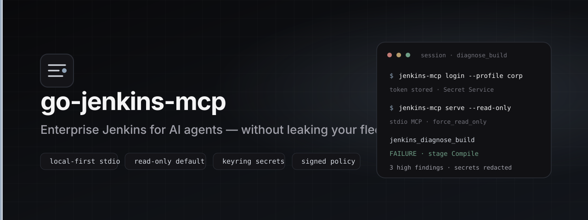
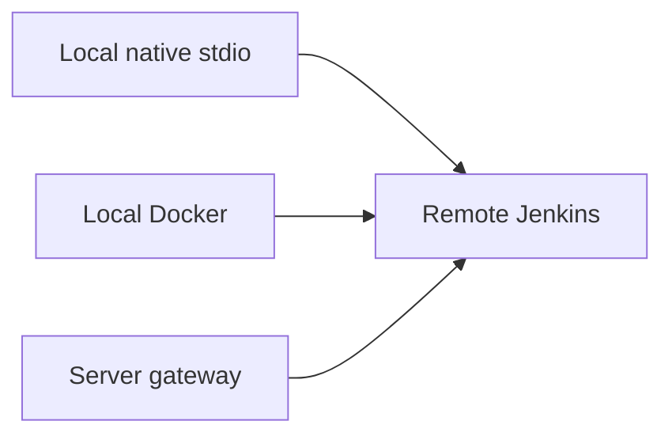

<p align="center">
  
</p>

<p align="center">
  <strong>Enterprise Jenkins MCP for Cursor and other AI agents</strong><br/>
  Local-first · keyring secrets · read-only by default · redacted diagnostics
</p>

<p align="center">
  <a href="https://hilather.github.io/go-jenkins-mcp/"></a>
  <a href="https://github.com/hilather/go-jenkins-mcp/releases/latest"></a>
  <a href="https://github.com/hilather/go-jenkins-mcp/actions/workflows/ci.yml"></a>
  <a href="LICENSE"></a>
  <a href="go.mod"></a>
</p>

**go-jenkins-mcp** is a Go [Model Context Protocol](https://modelcontextprotocol.io/)
server that lets AI agents triage Jenkins builds under a short leash: personal
identity, read-only defaults, bounded redacted output, and operator-grade policy.

Module: `github.com/hilather/go-jenkins-mcp` · Platforms: **Rocky Linux & Ubuntu** only.

## Security defaults

- Credentials live in the **OS keyring** after `login` — never in `mcp.json` or profile JSON
- **Read-only by default**; mutations require `--allow-mutations` and confirmation
- MCP policy is **deny-only** and never elevates Jenkins ACLs
- Logs, artifacts, and tool results are **budgeted and redacted**

## Capabilities

| Area | Highlights | Docs |
|------|------------|------|
| Data plane | Stdio MCP, job/build/log/test/artifact tools | [docs/features/](docs/features/) |
| Policy | RO gate, overlays, user/group bindings, budgets | [docs/policy-rbac.md](docs/policy-rbac.md) |
| Storage | Progressive Zstd frames, L1/L2 log cache, typed resource cache, per-type control plane (ADR 0017/0018), optional fleet peer cache | [docs/caching.md](https://github.com/hilather/go-jenkins-mcp/blob/master/docs/caching.md) · [v0.7.0 notes](https://github.com/hilather/go-jenkins-mcp/blob/v0.7.0/docs/release/RELEASE_NOTES_v0.7.0.md) |
| Admin | Local admin console + opt-in `admin_*` MCP | [docs/admin/](docs/admin/) |
| Gateway | Optional team-hosted HTTP / multi-user modes | [docs/gateway/](docs/gateway/) |
| Integrations | Opt-in adapters (ext-logs, work-items, OTel) | [docs/integrations/](docs/integrations/) |

## Choose a deployment



| Path | When to use | Guide |
|------|-------------|--------|
| **Local native** | Everyday Cursor on your workstation | [docs/getting-started/local-native.md](docs/getting-started/local-native.md) |
| **Local Docker** | Isolated container, no local Go | [docs/getting-started/local-docker.md](docs/getting-started/local-docker.md) |
| **Server** | Shared Linux gateway (Compose scaffold) | [docs/getting-started/server.md](docs/getting-started/server.md) |

Selector: [docs/getting-started/README.md](docs/getting-started/README.md).

### Local native (short)

```bash
# install binary from release tarball or: make build && sudo install -m 0755 bin/jenkins-mcp /usr/local/bin/
jenkins-mcp profile add corp --url https://jenkins.example.corp/
jenkins-mcp login --profile corp
jenkins-mcp status --profile corp
# Cursor mcp.json: command jenkins-mcp, args: serve --profile corp --stdio --read-only
```

### Server (short)

```bash
cp deploy/gateway/.env.example deploy/gateway/.env
# edit non-secret settings; keep secrets out of git
docker compose -f deploy/gateway/docker-compose.yml --env-file deploy/gateway/.env up -d --build
# terminate TLS at a reverse proxy → container loopback MCP port
```

## Documentation

| | |
|--|--|
| Full docs index | [docs/README.md](docs/README.md) |
| Architecture | [docs/architecture/README.md](docs/architecture/README.md) |
| User guide | [docs/user/README.md](docs/user/README.md) |
| Security | [docs/security/operator-guide.md](docs/security/operator-guide.md) |
| Contributing / CI | [CONTRIBUTING.md](CONTRIBUTING.md) · [AGENTS.md](AGENTS.md) |
| Releases | [GitHub Releases](https://github.com/hilather/go-jenkins-mcp/releases) · [docs/release/](docs/release/) |
| Issues | [GitHub Issues](https://github.com/hilather/go-jenkins-mcp/issues) |

## Develop

```bash
export PATH="$HOME/.local/go/bin:$PATH"
make fmt && make lint && make test && make build
make docs-check
```

Free disposable labs (opt-in): `make live-jenkins-test`, `make live-oauth-test`,
and related targets — see [docs/testing/qualification.md](docs/testing/qualification.md).

## License

MIT — see [LICENSE](LICENSE) and [NOTICE](NOTICE).
