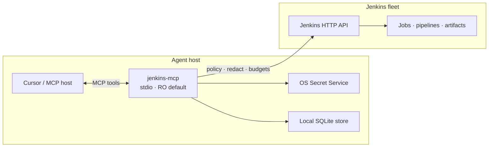

<p align="center">
  
</p>

<p align="center">
  <strong>Enterprise Jenkins MCP for Cursor and other AI agents</strong><br/>
  Local-first · keyring secrets · read-only by default · redacted diagnostics
</p>

<p align="center">
  <a href="https://hilather.github.io/go-jenkins-mcp/"></a>
  <a href="https://github.com/hilather/go-jenkins-mcp/releases/latest"></a>
  <a href="https://github.com/hilather/go-jenkins-mcp/actions/workflows/ci.yml"></a>
  <a href="LICENSE"></a>
  <a href="go.mod"></a>
</p>

<p align="center">
  <a href="https://hilather.github.io/go-jenkins-mcp/">Website</a> ·
  <a href="https://hilather.github.io/go-jenkins-mcp/getting-started.html">Quick start</a> ·
  <a href="docs/user/README.md">User guide</a> ·
  <a href="docs/security/operator-guide.md">Security</a> ·
  <a href="docs/jenkins-mcp-enterprise-architecture.md">Architecture</a> ·
  <a href="https://github.com/hilather/go-jenkins-mcp/releases">Releases</a>
</p>

---

## Why this exists

AI agents are excellent at reading build logs — and terrible at handling secrets,
blast radius, and audit trails. **go-jenkins-mcp** is a Go [Model Context Protocol](https://modelcontextprotocol.io/)
server that puts Cursor (and compatible hosts) on a short leash against Jenkins:

| Problem | How this project handles it |
| --- | --- |
| Tokens end up in `mcp.json` / shell history | Personal credentials live in the **OS keyring** after `login` |
| Agents over-write production | **Read-only by default**; mutations are opt-in with preview/confirm |
| Logs leak secrets into agent context | Built-in **redaction** on tool output and support bundles |
| Policy drifts per laptop | **Signed policy overlays** + fail-closed budgets |
| Diagnose-by-vibes | Deep **diagnostic tool surface** (compare, regression window, evidence) |

Built from the community seed [`simonfxr/go-jenkins-mcp`](https://github.com/simonfxr/go-jenkins-mcp) as a **behavioral seed** — not the long-term architecture. See [`UPSTREAM.md`](UPSTREAM.md).

---

## Features

- **Local-first stdio MCP** — Cursor-native process entry; optional HTTP gateway path
- **Profiles without secrets** — URL / TLS / proxy only; tokens never in config files
- **`login` → Secret Service** — verified identity, keyring-backed storage
- **RO default** — `force_read_only` posture for pilot and production
- **Mutation safety** — preview + confirmation tokens when mutations are explicitly enabled
- **Redaction & audit** — fail-closed logging posture for operators
- **Signed policy** — enterprise overlays that agents cannot casually bypass
- **Admin console** — local SPA for operator workflows (pilot path)
- **Tier-1 packaging** — Rocky Linux + Ubuntu; XDG config/cache layout
- **Conformance depth** — 50+ waves, 300+ Go test files, release evidence tooling

---

## Quick start

### 1. Build

Requires Go (see `go.mod`). Unit tests never need live Jenkins credentials.

```bash
make test
make build
./bin/jenkins-mcp version --json
```

### 2. Profile + login (no secrets in git or shell history)

```bash
jenkins-mcp profile add corp --url https://jenkins.example.corp/
jenkins-mcp login --profile corp          # prompts; stores token in Secret Service
jenkins-mcp status --profile corp
jenkins-mcp doctor --profile corp --offline
```

### 3. Cursor MCP entry (read-only)

```json
{
  "mcpServers": {
    "jenkins": {
      "command": "jenkins-mcp",
      "args": ["serve", "--profile", "corp", "--read-only", "--stdio"],
      "env": {
        "JENKINS_MCP_READ_ONLY": "true"
      }
    }
  }
}
```

> **Never** put API tokens, `user:token`, or `JENKINS_MCP_AUTH` in `args` / `env`.  
> That seed bootstrap path is a known defect ([`KNOWN_DEFECTS.md`](KNOWN_DEFECTS.md) KD-003).

Full pilot path: [`docs/user/README.md`](docs/user/README.md) · product walkthrough: [getting started](https://hilather.github.io/go-jenkins-mcp/getting-started.html)

---

## Architecture at a glance



| Layer | Responsibility |
| --- | --- |
| `cmd/jenkins-mcp` | Process entry (stdio default, optional HTTP) |
| `internal/tools` | MCP tool registration — no raw HTTP |
| `internal/jenkins` | Jenkins HTTP client — no MCP imports |
| `internal/{auth,policy,redact,mutation,store,…}` | Enterprise controls (FND-004/005) |
| `internal/adapter` | Optional integrations — **off by default** |
| `web/admin` | Operator admin console SPA |
| `site/` | Public product site (GitHub Pages) |

Deep dive: [`docs/jenkins-mcp-enterprise-architecture.md`](docs/jenkins-mcp-enterprise-architecture.md) · ADRs in [`docs/adr/`](docs/adr/)

---

## Security posture

- **Fail closed:** Jenkins allow ∧ global read-only ∧ MCP policy ∧ budgets
- **Secrets:** keyring only — never in profiles, MCP config, fixtures, or CI logs
- **Redaction:** tool results and support bundles scrub sensitive material
- **Mutations:** disabled unless explicitly enabled; confirmation token TTL enforced
- **Platforms:** Tier-1 Rocky Linux + Ubuntu · macOS best-effort · **Windows out of scope**

Operator guide: [`docs/security/operator-guide.md`](docs/security/operator-guide.md)  
Threat model: [`docs/security/threat-model.md`](docs/security/threat-model.md)  
Reporting: [`SECURITY.md`](SECURITY.md)

---

## Documentation map

| Start here | |
| --- | --- |
| [Product site](https://hilather.github.io/go-jenkins-mcp/) | Polished overview, start, architecture, security, docs hub |
| [User guide](docs/user/README.md) | Install → login → Cursor → diagnose workflows |
| [Admin guide](docs/admin/README.md) | Packaging, policy, gateway, live lab |
| [Tool contracts](docs/tool-contracts.md) | MCP tool inventory, budgets, RO vs mutation |
| [Agent usage](docs/agent-usage.md) | How agents should triage builds |
| [Pilot kit](docs/pilot/README.md) | Limited RO pilot evidence (REL-001) |
| [Release gates](docs/release/gates.md) | Production release gates (REL-002) |
| [Packaging](docs/packaging.md) | Tier-1 packages, update-check, XDG paths |
| [Planning pack](docs/README-jenkins-mcp-enterprise-planning-pack.md) | Architecture + backlog index |
| [Agent policy](AGENTS.md) | Mandatory rules for coding agents |

---

## Project layout

```text
cmd/jenkins-mcp/     Process entry (stdio / optional -http)
internal/jenkins/    Jenkins HTTP client (no MCP imports)
internal/tools/      MCP tool registration (no raw HTTP)
internal/contracts/  Typed refs (FND-005)
internal/apperr/     Error taxonomy (FND-005)
internal/{auth,policy,redact,mutation,store,…}/
web/admin/           Operator admin console
site/                GitHub Pages product site
docs/                Architecture, ADRs, guides, backlog
docs/adr/            Architecture decision records
deploy/              Local labs and packaging helpers
```

---

## Development

```bash
make test                         # unit + contract tests (no live Jenkins)
make build                        # ./bin/jenkins-mcp with version metadata
make lint                         # format + static checks when configured
./bin/jenkins-mcp update-check --json
./bin/jenkins-mcp release-evidence --offline
```

CI (`.github/workflows/ci.yml`) runs format, vet, tests (incl. race on Ubuntu),
build, package, and `govulncheck`. Untrusted PR jobs never receive Jenkins secrets.

Contributing workflow and backlog rules: [`CONTRIBUTING.md`](CONTRIBUTING.md) · [`AGENTS.md`](AGENTS.md)

---

## Status

| | |
| --- | --- |
| **Release** | [**v0.2.0**](https://github.com/hilather/go-jenkins-mcp/releases/tag/v0.2.0) |
| **Phase** | Phase 0 — baseline & architecture lock ([progress](docs/phase0-progress.md)) |
| **Posture** | Pilot-ready RO path · not a blanket production claim |

Incomplete work is tracked in the enterprise backlog and `KNOWN_DEFECTS.md`.

---

## Upstream

Behavioral seed: [`simonfxr/go-jenkins-mcp`](https://github.com/simonfxr/go-jenkins-mcp)  
Frozen commit + hashes: [`UPSTREAM.md`](UPSTREAM.md)  
Seed README / tool list: [`README.upstream.md`](README.upstream.md)  
Expected seed defects: [`KNOWN_DEFECTS.md`](KNOWN_DEFECTS.md)

---

## License

[MIT](LICENSE). Upstream attribution in `LICENSE`, `NOTICE`, and `UPSTREAM.md`.
