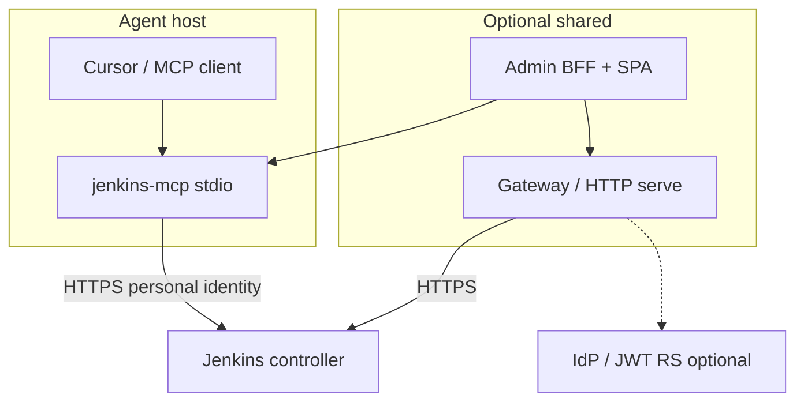

# Architecture

Current-state architecture for **go-jenkins-mcp**. Decisions that are irreversible
or cross-cutting live in [ADRs](../adr/README.md).

**Not in this tree:** phase boards, task backlogs, or delivery status. Open work
is tracked in GitHub Issues.

## Domain pages

| Page | Contents |
|------|----------|
| [runtime.md](runtime.md) | Process entrypoints, stdio vs HTTP vs gateway |
| [authentication.md](authentication.md) | Personal token, OIDC, gateway modes |
| [authorization.md](authorization.md) | RO default, deny-only RBAC, mutations |
| [storage-logs.md](storage-logs.md) | Progressive logs, L1/L2 cache, fleet peer cache |
| [admin.md](admin.md) | Admin BFF/SPA and admin MCP ops |
| [integrations.md](integrations.md) | Adapters and external systems |
| [deployment.md](deployment.md) | Deploy topologies and trust boundaries |
| [testing.md](testing.md) | Offline tests vs free labs |
| [platform.md](platform.md) | Tier-1 platform matrix |

## System context

## Package boundaries (summary)

| Package | Role |
|---------|------|
| `internal/jenkins` | HTTP client only — no MCP/tools |
| `internal/tools` | MCP tool handlers — no raw `net/http` to Jenkins |
| `internal/policy` | Deny-only overlays and budgets |
| `internal/auth` / `gateway` | Identity and multi-user obtain |
| `internal/store` / `logmirror` / `archive` | Cache and progressive logs |
| `internal/fleetcache` | Opt-in peer cache protocol (leaf deps) |
| `internal/admin` / `adminops` | Operator console + shared ops for MCP |
| `cmd/jenkins-mcp` | Wiring only |

Enforced by `internal/depgraph` (FND-004).

## Related

- Auth deep dive: [../auth-architecture.md](../auth-architecture.md)
- Policy: [../policy-rbac.md](../policy-rbac.md)
- Caching: [../caching.md](../caching.md)
- Historical monolith (archived): [../archive/jenkins-mcp-enterprise-architecture.md](../archive/jenkins-mcp-enterprise-architecture.md)
