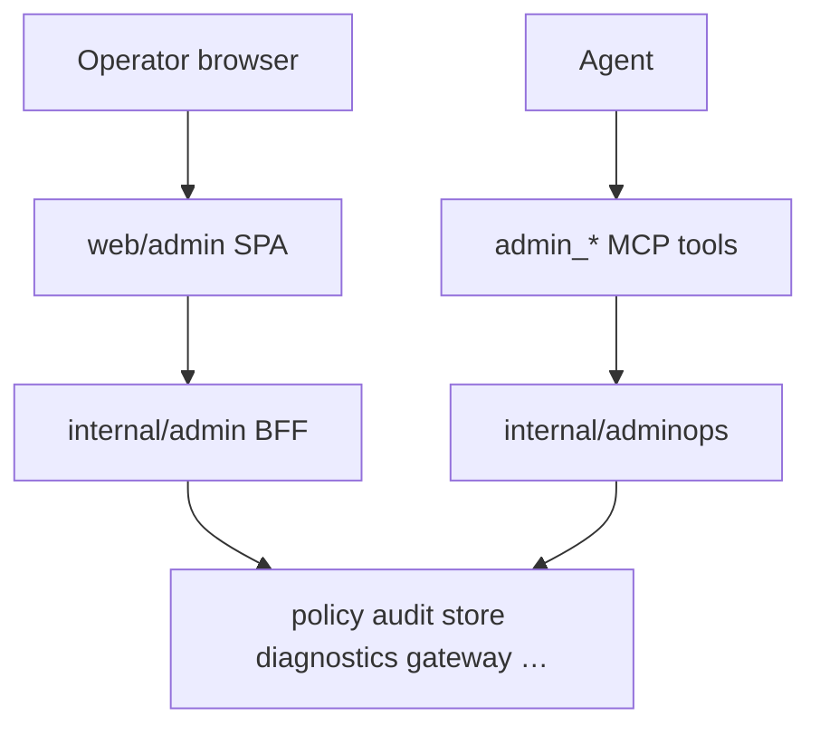

# Architecture — admin console and admin MCP

**Support status:** Opt-in supported

| Rule | Detail |
|------|--------|
| Shared libraries | MCP tools do **not** HTTP-proxy to admin serve |
| Secret-free | No tokens in JSON, logs, support bundles |
| Charts | Apache ECharts only in SPA |
| Opt-in | `--enable-admin-mcp` for admin tools on serve |
| SPA merge gate | `make admin-ui-check` / CI job `admin-ui` (Node 22). Go `lint-test-build` does not typecheck TSX. |

## Related

- [../admin/README.md](../admin/README.md)
- [../admin/mcp-ops-parity.md](../admin/mcp-ops-parity.md)
- ADR 0014
