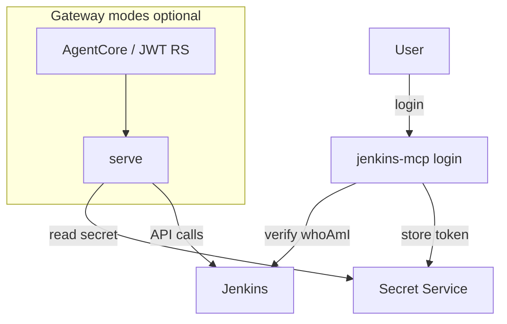

# Architecture — authentication

**Support status:** Supported (personal API token + keyring) · Opt-in / free-lab for OIDC/JWT/SAML modes

Stock Jenkins is **not** an OAuth/OIDC authorization server (ADR 0003).

| Mode | Status | Notes |
|------|--------|--------|
| Personal API token + Secret Service | Supported | Pilot default |
| OIDC browser login (profile) | Opt-in supported | Jenkins is resource, not AS |
| Gateway multi-user JWT | Free-lab validated | Site Entra pin optional |
| SAML SP (admin/policy identity) | Free-lab validated | POL-007 |
| Jenkins-as-AS | Not implemented (no-go) | [jas-no-go.md](../auth/jas-no-go.md) |

## Related

- [../auth-architecture.md](../auth-architecture.md)
- [../integrations/auth-modes.md](../integrations/auth-modes.md)
