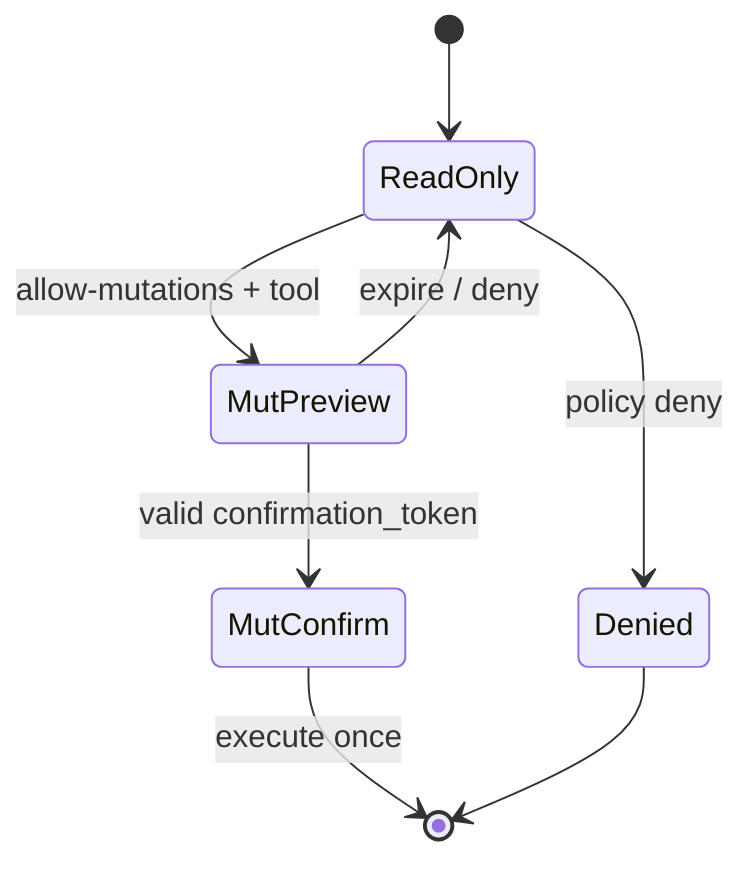

# Architecture — authorization and mutations

**Support status:** Supported (RO + deny-only) · Opt-in supported (mutations, signed overlays)

Effective access:

```text
Jenkins ACL  ∧  global/enterprise read-only  ∧  MCP policy denials  ∧  budgets
```

MCP policy **never elevates** Jenkins rights.



| Control | Target |
|---------|--------|
| Tool / job / node / view / artifact denials | Global, user, group bindings |
| Budgets / caps | Response size, concurrency |
| Mutations | Preview → confirm TTL; audit emit |

## Related

- [../policy-rbac.md](../policy-rbac.md)
- ADR 0004 global RO + deny-only RBAC
