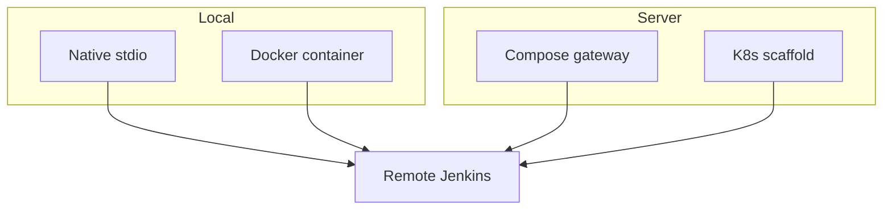

# Architecture — deployment topologies

| Topology | Doc |
|----------|-----|
| Local native | [../getting-started/local-native.md](../getting-started/local-native.md) |
| Local Docker | [../getting-started/local-docker.md](../getting-started/local-docker.md) |
| Server | [../getting-started/server.md](../getting-started/server.md) |

Trust: credentials stay on the MCP side; Jenkins remains source of truth for job ACL.
