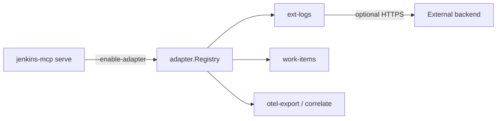

# Architecture — integrations

**Support status:** Opt-in supported (built-in adapters deny-by-default)

Adapters receive a restricted host surface — **no** Jenkins client or keyring by
default. See [../integrations/adapters.md](../integrations/adapters.md).
