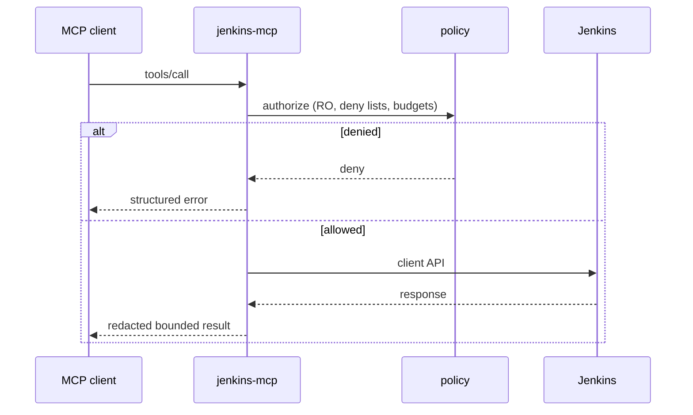

# Architecture — runtime

**Support status:** Supported (stdio) · Opt-in supported (HTTP / gateway / admin)

## Entrypoints

| Mode | Command sketch | Audience |
|------|----------------|----------|
| Stdio MCP | `serve --stdio --profile …` | Cursor local |
| HTTP MCP | `serve` with HTTP bind flags | Lab / reverse-proxied |
| Gateway | `serve --gateway` / gateway wiring | Team-hosted |
| Admin | `admin serve` | Operators |

## Fail-closed defaults

- Read-only unless mutations explicitly enabled
- Empty/invalid identity fails auth rather than elevating
- Response size and fan-out budgets enforced in tools

## Related

- ADR 0002 local stdio default
- [deployment.md](deployment.md)
