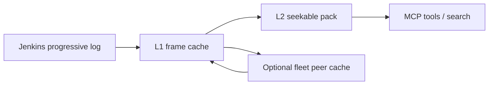

# Architecture — logs and cache

**Support status:** Supported (local L1/L2) · Opt-in supported (fleet peer cache)

## Progressive logs

- No unbounded `ReadAll` of console logs
- Independent Zstandard frames for progressive download
- L2: seekable **multi-frame** `.tar.zst` only (never call single-frame “random access”)

| Plane | Default | Doc |
|-------|---------|-----|
| Per-profile L1/L2 under XDG | On with quota | [../caching.md](../caching.md) |
| Gateway file caches | Opt-in | [../caching.md](../caching.md) |
| Fleet peer cache | **Off** by default | [../fleet/shared-cache-operator.md](../fleet/shared-cache-operator.md) |

## Related

- ADR 0005 / 0007 frames and packs
- ADR 0016 fleet P2P cache
