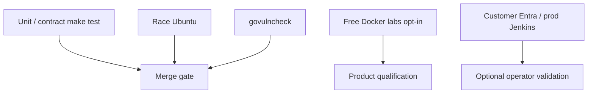

# Architecture — testing and qualification

| Layer | Required for merge? |
|-------|---------------------|
| `make test` / lint / build / package / vuln | Yes (CI) |
| Free labs | When changing integration boundaries |
| Customer production pin | No — optional |

See [../testing/qualification.md](../testing/qualification.md).
Optional operator Entra walkthrough (not a merge gate or production pin):
[../testing/entra-jwt-rs-lab.md](../testing/entra-jwt-rs-lab.md).
