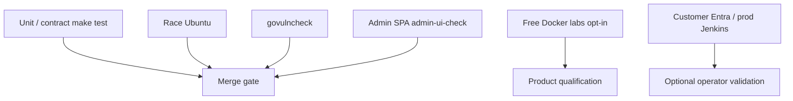

# Architecture — testing and qualification

| Layer | Required for merge? |
|-------|---------------------|
| `make test` / lint / build / package / vuln | Yes (CI job `lint-test-build` + `govulncheck`) |
| `make admin-ui-check` | Yes (CI job `admin-ui`; Node 22; compiles `web/admin` TSX) |
| Free labs | When changing integration boundaries |
| Customer production pin | No — optional |

See [../testing/qualification.md](../testing/qualification.md).
