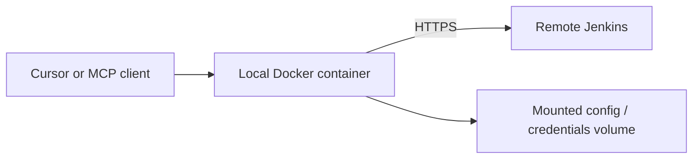

# Quick start — local Docker (container → remote Jenkins)

**Support status:** Opt-in supported · Free-lab validated (admin/support stack);
end-user MCP-in-container toward remote Jenkins is documented here as a
first-class path. Image may be **built locally** when no public tag is published.

**Default posture:** **read-only** (same as native). Do not enable mutations
unless you intentionally pass `--allow-mutations` in the container command.

MCP runs in **Docker on your workstation** and connects over HTTPS to an
**existing remote Jenkins**. You do **not** need a local Go toolchain. Jenkins
does **not** need to run in the same Compose project.



## Prerequisites

| Requirement | Notes |
|-------------|--------|
| Docker Engine + Compose v2 | `docker compose version` |
| Remote Jenkins | URL + personal API token (or site-approved identity) |
| Host platform | Rocky Linux / Ubuntu (Tier 1). No local Go required for this path |
| Corporate CA / proxy | Mount CA bundle or set proxy env when required |

## Positioning

| This path | Not this path |
|-----------|----------------|
| End-user MCP isolation on the laptop | Production shared gateway → [server.md](server.md) |
| Container → **remote** Jenkins | Bundled lab Jenkins only (`with-jenkins` profile is optional test fixture) |
| Optional admin UI for support | Required admin SPA for triage (stdio/HTTP MCP is the data plane) |

Admin/support-oriented stack details: [../../deploy/local/README.md](../../deploy/local/README.md).

## Configuration

From the repository root (clone or release tree):

```bash
cp deploy/local/.env.example deploy/local/.env
# Edit deploy/local/.env — never commit it
# Set at least:
#   JENKINS_MCP_ADMIN_TOKEN=<openssl rand -hex 24>   # for admin BFF if used
# Configure Jenkins URL via profile bootstrap / env as documented in deploy/local
```

Credentials: use the supported mechanism for the image (profile + keyring file or
mounted secret path). **Never** put API tokens in Compose YAML or git.

Minimal start (admin/support default stack):

```bash
make local-docker-up
# Expect: containers healthy; admin on http://127.0.0.1:8787 when enabled

make local-docker-status
# Expect: secret-free health/ready JSON

make local-docker-doctor
# Expect: doctor output without tokens
```

For **MCP HTTP** from the container (optional profile):

```bash
export LOCAL_COMPOSE_PROFILES=http
make local-docker-up
# Expect: loopback MCP HTTP (default host mapping 127.0.0.1:8081)
```

Point the container profile at your **remote** Jenkins URL (not only lab
`with-jenkins`). Lab Jenkins is optional:

```bash
export LOCAL_COMPOSE_PROFILES=http,with-jenkins   # disposable lab only
```

## Cursor / MCP client

When using host-native stdio against a remote Jenkins, prefer
[local-native.md](local-native.md). When using container HTTP MCP:

```json
{
  "mcpServers": {
    "jenkins": {
      "url": "http://127.0.0.1:8081/mcp"
    }
  }
}
```

Exact path prefix depends on `JENKINS_MCP_HTTP_PATH_PREFIX` / server flags — see
[deployment/local-docker.md](../deployment/local-docker.md). Reload the client after config changes.

Shared host/container log cache (opt-in Model 2 XDG):  
`deploy/local/docker-compose.shared-xdg.example.yml` + host `XDG_*` in mcp.json.

## Verification

| Step | Action | Success signal |
|------|--------|----------------|
| Container | `make local-docker-status` | Running / healthy |
| Health | `curl` admin or MCP health endpoints | HTTP 200, secret-free JSON |
| Identity | doctor / status via container | Remote Jenkins identity |
| RO query | list jobs / get job | Data from configured remote URL |

Prove the remote endpoint: doctor/status must show the Jenkins base URL you set
(not an accidental lab URL unless you opted into `with-jenkins`).

## Operations

```bash
make local-docker-up      # start
make local-docker-down    # stop + remove volumes (destructive to container data)
# Logs: docker compose -f deploy/local/docker-compose.yml logs -f
# Upgrade: git pull / new tag → rebuild image → up
# Rollback: check out previous tag → rebuild/up
```

## Troubleshooting

| Issue | What to check |
|-------|----------------|
| DNS / networking | Container can resolve Jenkins hostname (`docker exec` + curl) |
| TLS | Mount corporate CA; `SSL_CERT_FILE` |
| Proxy | `HTTP_PROXY` / `HTTPS_PROXY` / `NO_PROXY` on the service |
| Auth | Token valid; Jenkins crumb/ACL |
| MCP transport | Client URL/port matches published loopback port |
| Permissions | Volume UID matches container user |
| Lost credentials | Volume recreated by `down -v`; restore from backup |

## Cleanup

```bash
make local-docker-down
rm -f deploy/local/.env    # local secrets only
# Remove unused images: docker image prune (careful)
```

## Related

- Deploy reference: [deployment/local-docker.md](../deployment/local-docker.md)
- Admin-only topology notes: [deployment/local-docker-admin.md](../deployment/local-docker-admin.md)
- Caching models: [caching.md](../caching.md)
