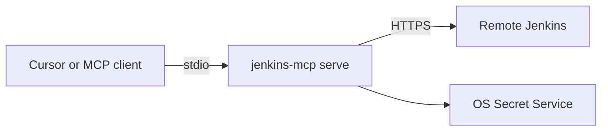

# Quick start — local native (stdio → remote Jenkins)

**Support status:** Supported · Free-lab validated (disposable Jenkins)

MCP runs as a **native process** on your workstation and talks over HTTPS to a
**remote** Jenkins. This is the default Cursor path (ADR 0002).



## Prerequisites

| Requirement | Notes |
|-------------|--------|
| OS | Rocky Linux or Ubuntu (Tier 1) |
| Binary | Package install **or** Go 1.25.x + `make build` |
| Jenkins | Reachable HTTPS URL; personal user + API token with Job/Read (and whatever your triage needs) |
| Keyring | Secret Service (`libsecret` / gnome-keyring / KeePassXC) unlocked for interactive login |
| TLS / proxy | Corporate CA or proxy if your network requires them |

## Install

**From a release package (preferred when published):**

```bash
tar -xzf jenkins-mcp_*_linux_amd64.tar.gz
sudo install -m 0755 usr/bin/jenkins-mcp /usr/local/bin/jenkins-mcp
jenkins-mcp version
# Expect: version string / JSON without errors
```

**From source (developer fallback):**

```bash
export PATH="$HOME/.local/go/bin:$PATH"
git clone https://github.com/hilather/go-jenkins-mcp.git
cd go-jenkins-mcp
make build
sudo install -m 0755 bin/jenkins-mcp /usr/local/bin/jenkins-mcp
jenkins-mcp version
```

## Profile and login

Profiles store **non-secret** connection data only.

```bash
jenkins-mcp profile add corp --url https://jenkins.example.corp/
# Expect: profile written under XDG config (no token)

jenkins-mcp login --profile corp
# Expect: interactive username + API token; success prints identity only

jenkins-mcp status --profile corp
# Expect: authenticated identity; no secret material

jenkins-mcp doctor --profile corp --offline
# Expect: doctor checks pass or list actionable residuals (secret-free)
```

## Cursor MCP configuration

```json
{
  "mcpServers": {
    "jenkins": {
      "command": "jenkins-mcp",
      "args": [
        "serve",
        "--profile", "corp",
        "--stdio",
        "--read-only"
      ]
    }
  }
}
```

Reload / restart the MCP client after saving. **Do not** put tokens in `env` or `args`.

## Verification

| Step | Command / action | Success signal |
|------|------------------|----------------|
| Binary | `jenkins-mcp version` | Non-zero version, exit 0 |
| Identity | `jenkins-mcp status --profile corp` | Username / URL shown, no token |
| Client | Cursor tool discovery | `jenkins_*` tools listed |
| RO query | Agent or client: list jobs / whoami-style tool | Jobs or identity returned; no secret leakage |

Disposable lab alternative (no production Jenkins):

```bash
make live-jenkins-up
# Point a profile at http://127.0.0.1:18080 with lab credentials from testdata/jenkins-compose
make live-jenkins-test   # or follow testdata/jenkins-compose/README.md
make live-jenkins-down
```

## Common failures

| Symptom | Likely cause |
|---------|----------------|
| `command not found` | Binary not on `PATH` |
| Login / keyring errors | Secret Service locked or missing |
| TLS verify failed | Missing corporate CA (`SSL_CERT_FILE` / profile TLS options) |
| Proxy errors | Configure HTTPS proxy env vars for the client process |
| 401/403 from Jenkins | Bad token or insufficient Jenkins permissions |
| Tools missing | Client not reloaded; or RO/policy deny |

## Cleanup

```bash
jenkins-mcp logout --profile corp    # remove keyring secret when supported
# Remove profile files under ~/.config/jenkins-mcp/ (see packaging.md)
# Uninstall package or delete /usr/local/bin/jenkins-mcp
```

## Related

- Full deploy notes: [deployment/local-native-stdio.md](../deployment/local-native-stdio.md)
- User guide: [user/README.md](../user/README.md)
- Equal alternative without host Go: [local-docker.md](local-docker.md)
