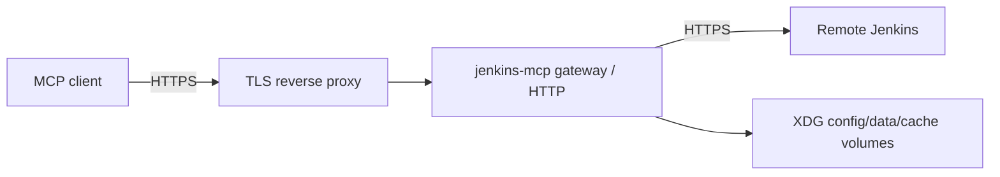

# Quick start — server gateway

**Support status:** Opt-in supported · Free-lab validated (offline qualify +
compose scaffold). Treat packaging as a **supported scaffold** for pilot/lab;
site production pin (Entra, corporate mesh) is optional operator validation.

Canonical first topology:

> Single-node Docker Compose, read-only, personal API-token vault posture,
> behind a TLS reverse proxy.



## Prerequisites

| Requirement | Notes |
|-------------|--------|
| Linux host | Rocky Linux or Ubuntu + Docker Engine / Compose v2 |
| DNS + TLS | Certificate for the public hostname |
| Network | Host can reach Jenkins; clients can reach reverse proxy |
| Resources | Start ~0.1–1 CPU, 128–512 MiB (see compose limits); tune after measure |
| Jenkins perms | Personal token or site-approved gateway auth mode |

Advanced modes (JWT resource-server, SAML, OBO, mTLS) are **drill-downs**, not
first-run: [integrations/README.md](../integrations/README.md).

## Install and configure

```bash
git clone https://github.com/hilather/go-jenkins-mcp.git
cd go-jenkins-mcp
# Or unpack a release tag

cp deploy/gateway/.env.example deploy/gateway/.env
# Edit non-secret settings only: profile URL, bind, origins, resource limits
# Generate secrets out of band; never commit deploy/gateway/.env

docker compose -f deploy/gateway/docker-compose.yml --env-file deploy/gateway/.env config
# Expect: rendered compose without errors

docker compose -f deploy/gateway/docker-compose.yml --env-file deploy/gateway/.env up -d --build
# Expect: container running
```

Configure reverse proxy (TLS terminate, forward to published loopback MCP port).
See [deployment/reverse-proxy-and-tls.md](../deployment/reverse-proxy-and-tls.md).

Offline qualify (no live Jenkins required for residual honesty):

```bash
export PATH="$HOME/.local/go/bin:$PATH"
make build
./bin/jenkins-mcp gateway qualify --offline
# Expect: JSON residual report; exit 0 for offline harness
```

## Verification

| Check | How | Success |
|-------|-----|---------|
| Liveness | `GET /healthz` | `200` `{"status":"ok"}` (secret-free) |
| Readiness | `GET /readyz` | `200` when ready; `503` when not |
| Logs | `docker compose … logs` | No tokens/Authorization headers |
| Client | Point MCP client at HTTPS proxy URL | Tools discoverable |
| RO call | List jobs / identity | Data from configured Jenkins |
| Lab smoke | `make residual-smoke` or gateway docs smoke | Pass or documented skip |

## Operations

```bash
docker compose -f deploy/gateway/docker-compose.yml --env-file deploy/gateway/.env stop
docker compose -f deploy/gateway/docker-compose.yml --env-file deploy/gateway/.env start
docker compose -f deploy/gateway/docker-compose.yml --env-file deploy/gateway/.env down
```

Upgrade: backup volumes + `.env` → new tag → rebuild/up.  
Rollback: previous image/tag + restore config volumes.  
See [deployment/upgrades-and-rollback.md](../deployment/upgrades-and-rollback.md).

## Alternatives (linked, not first-run)

- Kubernetes scaffold: [deployment/server-kubernetes.md](../deployment/server-kubernetes.md)
- systemd: [deployment/server-systemd.md](../deployment/server-systemd.md)
- Multi-fleet: [fleet/multi-fleet-rollout.md](../fleet/multi-fleet-rollout.md)

## Related

- Compose detail: [deployment/server-compose.md](../deployment/server-compose.md)
- Gateway docs: [gateway/README.md](../gateway/README.md)
- Deploy package README: [../../deploy/gateway/README.md](../../deploy/gateway/README.md)
